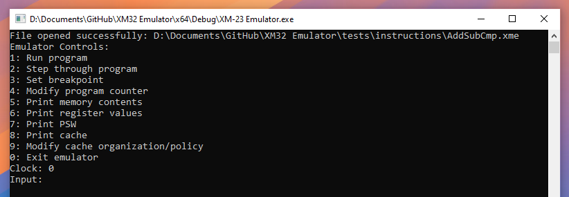
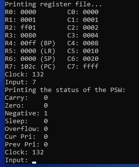
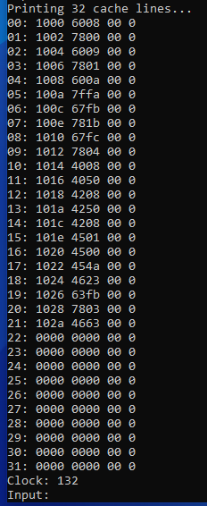

# XM-23 Reduced Instruction Set Computer (RISC) Emulator

A console emulator for the XM-23 RISC.

## Description

The XM-23 RISC is an in-house creation by Dalhousie Professor Dr. Hughes. Using a provided datasheet, we were tasked with writing an emulator to replicate all the features documented. This project significantly enhanced my understanding of low-level computer operations and was an overall fantastic learning experience.

## Architecture Features

* **Program Loading**: Motorola S-Record (SREC) files are used for input.
* **Fully Implemented Instruction Cycle**: Execution follows the traditional sequential fetch, decode, execute instruction cycle.
* **Integrated Cache**: Reduces the number of times instructions and data are fetched from main memory, theoretically improving performance.
* **Interrupt Handling**: Interrupt Service Routines (ISR) handle any supervisory calls and are implemented using the fetch method. The addresses of the ISRs and their functionality are user-defined.

## Emulator Features

* **Execution**: Program is run as normal. Can be stopped using `Ctrl+c`.
* **Step Through Execution**: Programs are run one instruction at a time, allowing for inspection of the CPU and memory state at each step.
* **Breakpoint Setting**: A breakpoint can be set to stop program execution at a chosen memory address.
* **In-Depth Monitoring**: Contents of the CPU registers, virtual memory, program status word, and cache can be printed to the console.
* **Cache Mode Switching**: Two types of cache mappings—direct and associative—are included, along with two cache policies: write-back and write-through. These settings can be configured, enabling comparisons between the different modes.

## Examples

Documentation (Lab Reports) and testing programs written in Assembly have been provided.

<!--- Cool way to do images using HTML! --->

  
  
Emulator Interface

  
  
Registers and PSW Printout

  
  
Cache Printout

## Notes

This was an academic project for ECED 3403 at Dalhousie University in the Summer of 2023. Please **DO NOT COPY** this repository for academic submission.

## Acknowledgments

Thank you to Dr. Hughes who was a **huge** help during the development of this project.